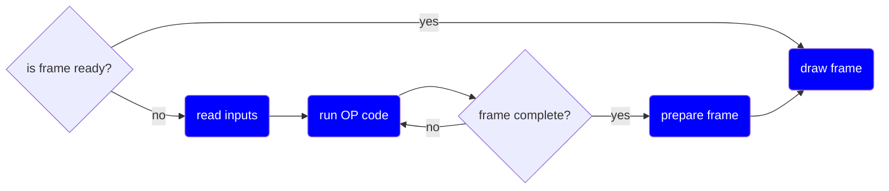
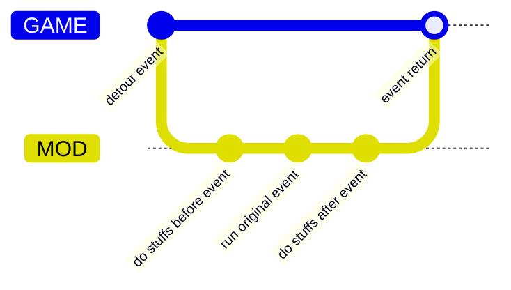

# motw (Mod of Training Wolves)

## Description

MOTW is a mod for the game Garou: Mark of the Wolves (Steam version) that adds a enhanced training mode.

## Features

- Record and playback of inputs
- Save and load states
- Input display
- Hitbox display
- Gauge data display

## How to use

1. Download the latest **motw.zip** release from the [Releases Page](https://github.com/alanoliveira/motw/releases).
2. Extract the files to any folder on your system.
3. Start **Garou: Mark of the Wolves** and initiate a versus match (Main Menu -> Normal Mode -> Versus).
4. Run `motw.exe`.
5. Press `Start` (pause the game) to access the enhanced training mode menu.
      - Inside the menu press `A` (light punch) to confirm
6. Press `F7` to quit

## How it works

It works by detouring some functions of the original game, and then executing some code 
before and/or after the original function.

This is a scratch of the flow of the game workflow:

When this mod run, for each event marked in blue, we detour the original:

Because of the detouring, Windows might think that the game is a virus.  
If you trust, you can add the game to the exceptions of your antivirus.

## Acknowledgments

Everything I learned about how Garou hitboxes work I owe to [dammit](https://dammit.typepad.com/) and his
scripts for [MAME-rr](https://code.google.com/archive/p/mame-rr/).
